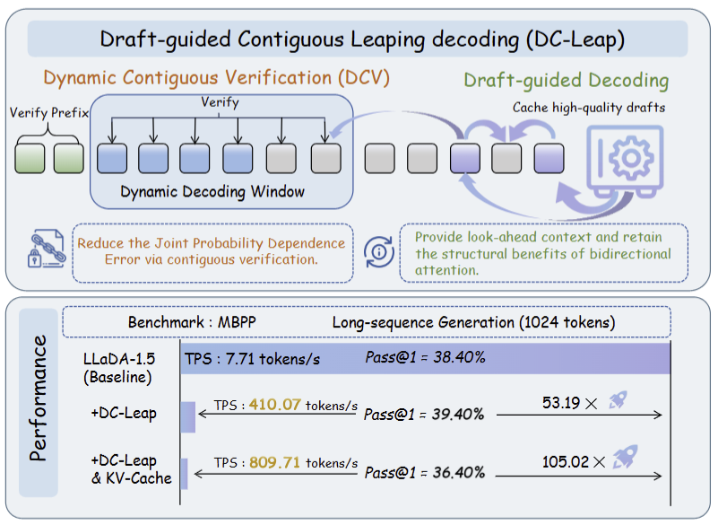
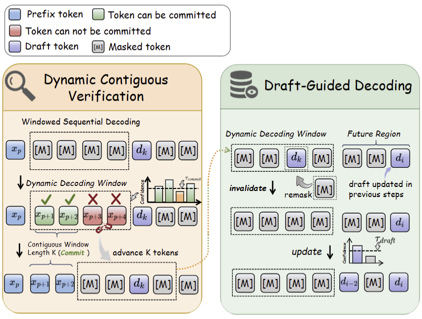

<div align="center">

<p align="center">
  
</p>

<h1>DC-Leap: Training-Free Acceleration of dLLMs<br>via Draft-Guided Contiguous Leaping Decoding</h1>

<div>
    <a href="https://openreview.net/profile?id=~Yanhua_Jiao1" target="_blank">Yanhua Jiao</a><sup>1,2</sup> |
    <a href="https://scholar.google.com/citations?user=ZtdT6lMAAAAJ&hl=zh-CN&oi=sra" target="_blank">Tianyi Wu</a><sup>1</sup> |
    <a href="https://openreview.net/profile?id=~Xiaoxi_Sun2" target="_blank">Xiaoxi Sun</a><sup>1</sup> |
    <a href="https://scholar.google.com/citations?user=dQssXVsAAAAJ&hl=zh-CN&oi=sra" target="_blank">Yulin Li</a><sup>1</sup> |
    <a href="https://scholar.google.com/citations?hl=zh-CN&user=gq29DtwAAAAJ" target="_blank">Huiling Zhen</a><sup>3</sup> |
    <a href="https://qinlibo-hit.github.io/index_en.html" target="_blank">Libo Qin</a><sup>1</sup> |
    <a href="https://scholar.google.com/citations?hl=zh-CN&user=5NiJ1VoAAAAJ" target="_blank">Baotian Hu</a><sup>1,2</sup> |
    <a href="https://scholar.google.com/citations?user=mEjhz-IAAAAJ&hl=zh-CN&oi=ao" target="_blank">Zhuotao Tian</a><sup>1,2 †</sup> |
    <a href="https://scholar.google.com/citations?&user=CncXH-YAAAAJ" target="_blank">Min Zhang</a><sup>1,2</sup> 

</div>
<br>
<div>
    <sup>1</sup> Harbin Institute of Technology, Shenzhen &nbsp;&nbsp; <sup>2</sup> Shenzhen Loop Area Institute &nbsp;&nbsp; <sup>3</sup> Huawei Noah’s Ark Lab
</div>
<br>
<div>
    <sup>†</sup>Corresponding Author
</div>
<br>
<div align="center">

<a href='https://icml.cc/'></a>
<a href="DC-Leap.pdf"></a>


</div>

---
<div align="left">

## 📚 TABLE OF CONTENTS
1. [Overview and Performance](#-overview-and-performance)
2. [Method](#-method)
3. [Graio Demo](#-gradio-demo)
4. [News](#-news)
5. [How to Run](#-how-to-run)
6. [Acknowledgements](#️-acknowledgements)
7. [Citation](#-citation)

## 📖 Overview and Performance
<p align="center">
  
</p>

DC-Leap unlocks the significant acceleration potential of dLLMs.

**Key Achievements:**
*   ⚡ **Massive Speedups:** Achieves up to **53.19×** speedup on MBPP for long-sequence generation (1024 tokens).
*   🚀 **Orthogonal to KV-Cache:** Enables further speedup when combined with KV-Cache designed for dLLMs.
*   🛡️ **Comparable Quality:** Maintains comparable performance to baselines and other parallel decoding methods across diverse benchmarks.
*   🔧 **Universal Compatibility:** A training-free method compatible with [LLaDA-8B-Instruct](https://huggingface.co/GSAI-ML/LLaDA-8B-Instruct), [LLaDA-1.5](https://huggingface.co/GSAI-ML/LLaDA-1.5),and [Dream-v0-7B-Instruct](https://huggingface.co/Dream-org/Dream-v0-Instruct-7B).


## 🌈 Method

<p align="center">
  
</p>

DC-Leap consists of two core mechanisms: Dynamic Contiguous Verification (DCV) and Draft-Guided Decoding. DCV ensures that the model strictly follows the left-to-right decoding order to safely use much lower confidence thresholds for multi-token acceptance, while the Draft-Guided Decoding leverages high-confidence tokens outside the current window as semantic anchors to provide right-side look-ahead context for faster convergence.


## 🎨 Graio Demo

You can `cd ./llada` or `cd ./llada1.5` and run `python demo.py` to enjoy a graio demo.

<p align="center">
  
</p>


## 📢 News

* **[2026.05.01]**  Our paper has been accepted by **ICML 2026**🎖️.

## 🛠️ How to Run

## 1. Install Dependencies

```bash
pip install -r requirements.txt
```
## 2. Model Setup

After downloading [LLaDA-8B-Instruct](https://huggingface.co/GSAI-ML/LLaDA-8B-Instruct), [LLaDA-1.5](https://huggingface.co/GSAI-ML/LLaDA-1.5), and [Dream-v0-7B-Instruct](https://huggingface.co/Dream-org/Dream-v0-Instruct-7B), replace the `/path/to/your/modelname` in the code with your local path.

## 3. Test Single Questions

To test a single question for a specific model, run the corresponding `generate.py` file within its directory.

*   **Dream-v0-7B-Instruct:**
    ```bash
    python dream/generate.py
    ```

*   **LLaDA-8B-Instruct:**
    ```bash
    python llada/generate.py
    ```

*   **LLaDA-1.5:**
    ```bash
    python llada1.5/generate.py
    ```

## 4. Full Benchmark Evaluation

Comprehensive evaluations across all benchmarks are managed via scripts in the `scripts/` directory, categorized by model.

### Available Benchmarks

Each model subdirectory contains five specialized shell scripts:

*   `math.sh`: Evaluation on the MATH dataset.
*   `gsm8k.sh`: Evaluation on GSM8K.
*   `humaneval.sh`: Evaluation on HumanEval.
*   `mbpp.sh`: Evaluation on MBPP.
*   `ifeval.sh`: Evaluation on IFEval.

### Running Evaluations

#### For Dream Model

```bash
cd scripts/eval_dream
bash math.sh      # Run MATH evaluation
bash gsm8k.sh     # Run GSM8K evaluation
# Repeat for humaneval.sh, mbpp.sh, or ifeval.sh
```

#### For LLaDA Model

```bash
cd scripts/eval_llada
bash math.sh
bash gsm8k.sh
# Repeat for other scripts
```

#### For LLaDA 1.5 Model

```bash
cd scripts/eval_llada1.5
bash math.sh
bash gsm8k.sh
# Repeat for other scripts
```

## ❤️ Acknowledgments 
We sincerely thank the authors of [LLaDA](https://github.com/ML-GSAI/LLaDA/), [Dream](https://github.com/DreamLM/Dream), [Fast-dLLM](https://github.com/NVlabs/Fast-dLLM), [Learning-to-Parallel-Decoding](https://github.com/ims-kdks/Learning-to-Parallel-Decoding), [LocalLeap](https://github.com/friedrichor/LocalLeap) and [dLLM-Cache](https://github.com/maomaocun/dLLM-cache) for their remarkable work and open-source contributions.

## 📜 Citation

If you find our work useful in your research, please consider citing our paper:

```bibtex
@inproceedings{jiao2026dcleap,
title={DC-Leap: Training-Free Acceleration of dLLMs
via Draft-Guided Contiguous Leaping Decoding},
author={Jiao Yanhua, and Wu Tianyi and Sun Xiaoxi  and Li Yulin and Zhen Huilin and Qin Libo and Hu Baotian and Tian Zhuotao and Zhang Min},
booktitle={Forty-third International Conference on Machine Learning},
year={2026}
}
```
